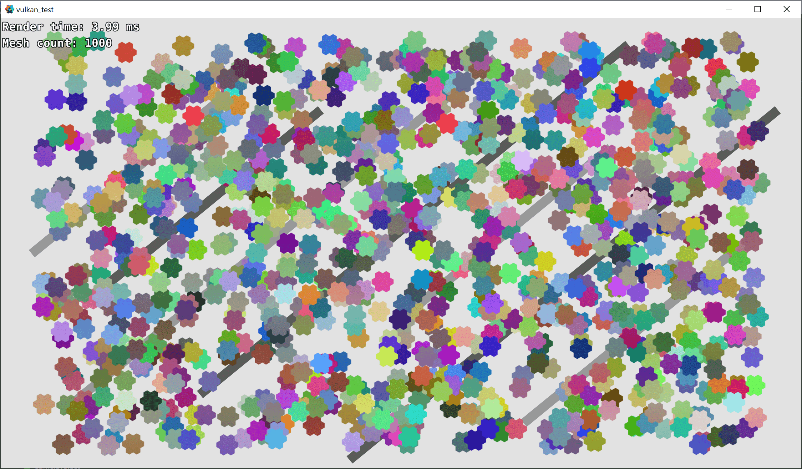
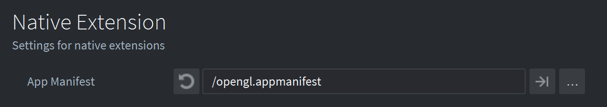
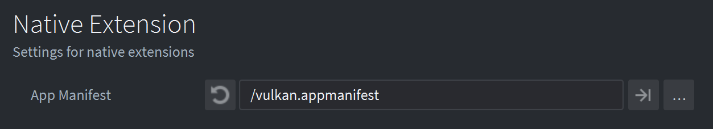
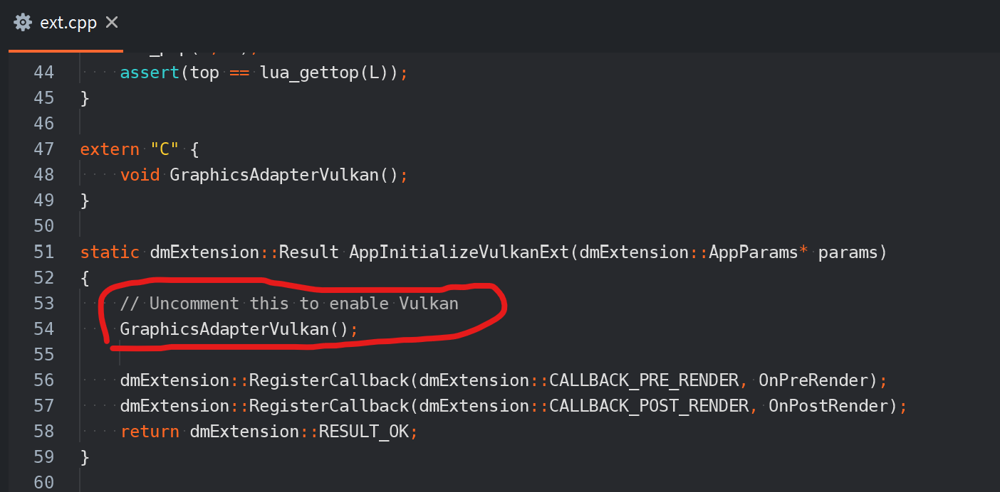

# Vulkan Test

This demo aims to stress test Defold Vulkan renderer and to catch bugs. It spawns 1000 mesh objects and measures the time required to render the scene using PreRender and PostRender callbacks.

## How To Use

Press *F2* to toggle profiler.

### OpenGL

Set the default .appmanifest:

### Vulkan

Set this .appmanifest for Vulkan:

And uncomment this line in file `vulkan_ext/src/ext.cpp` to enable Vulkan adapter:

