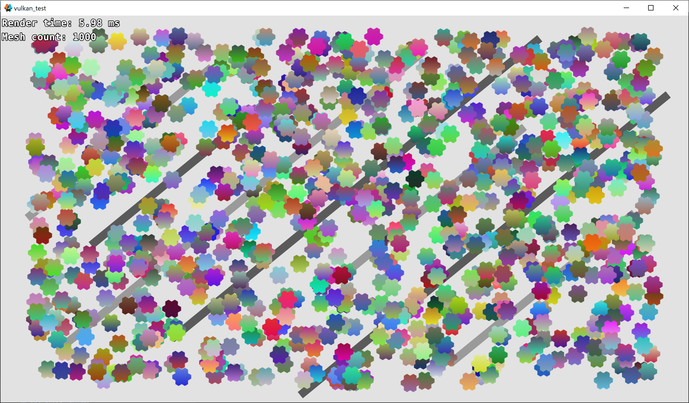

# Vulkan Test

This demo aims to stress test Defold Vulkan renderer and to catch bugs. It spawns 1000 mesh objects and measures the time required to render the scene using PreRender and PostRender callbacks.

## How To Use

### OpenGL

### Vulkan

